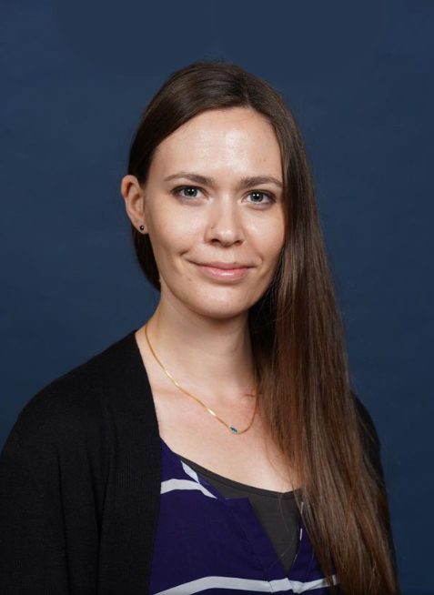

###
###
&nbsp;
&nbsp;
&nbsp;
&nbsp;
&nbsp;

## About {.tabset .tabset-fade}
&nbsp;


Carrie Wright is a Senior Staff Scientist at the [Fred Hutchinson Cancer Research Center](https://www.fredhutch.org/) and an affiliated faculty member at the [Johns Hopkins Bloomberg School of Public Health (JHSPH)](https://www.jhsph.edu/).

Dr. Wright's work is focused on innovating ways to make data science and computational biology more accessible. She is passionate about helping scientists, researchers, nonprofit organizations, and others utilize these skills to advance science, medicine, and social justice. She is a member of the [Open Case Studies](https://opencasestudies.github.io/) team, the [Genomic Data Science Community Network (GDSCN)](https://www.gdscn.org/home), and the [Informatics Technology for Cancer Research (ITCR) Training Network (ITN)](https://www.itcrtraining.org/). She also currently serves as chair of the [ITCR OPEN Group](https://www.itcrtraining.org/open).  

Previously, Dr. Wright was an Assistant Scientist in the Department of [Biostatistics](https://www.jhsph.edu/departments/biostatistics/) at the [Johns Hopkins Bloomberg School of Public Health (JHSPH)](https://www.jhsph.edu/) and a member of the [Johns Hopkins Data Science Lab (DaSL)](https://jhudatascience.org/).

Prior to joining the JHSPH, Dr. Wright was a Postdoctoral Fellow at the [Lieber Institute for Brain Development (LIBD)](https://www.libd.org/), where her research focused on uncovering genetic mechanisms in psychiatric disease (with a particular emphasis on non-coding RNA) through the utilization of data science tools. At LIBD, Dr. Wright co-founded the [LIBD rstats club](http://research.libd.org/rstatsclub/), a community designed to encourage others to learn more about R programming and statistics. Dr. Wright has also served as an instructor for the [Baltimore Underground Science Space](http://www.bugssonline.org/) and the [Johns Hopkins Center for Talented Youth](https://cty.jhu.edu/).

```{r, echo = FALSE, fig.align='center', out.width= "20%"}

```

See Dr. Wright's CV on [overleaf](https://www.overleaf.com/read/jkhxnxcyctjn).
&nbsp;

You can find Carrie on GitHub at [carriewright11](https://github.com/carriewright11/).


&nbsp;<center>
{width=500px, }
</center>

&nbsp;
&nbsp;


<script type="text/javascript" id="clustrmaps" src="//cdn.clustrmaps.com/map_v2.js?cl=0e1633&w=300&t=tt&d=mMJdncczrKczeO0j6-ofVvIOdAmrUwpy0FcAIJeCdV0&co=0b4975&cmo=3acc3a&cmn=ff5353&ct=cdd4d9"></script>


<!-- <script type='text/javascript' id='clustrmaps' src='//cdn.clustrmaps.com/map_v2.js?cl=0e1633&w=300&t=n&d=mMJdncczrKczeO0j6-ofVvIOdAmrUwpy0FcAIJeCdV0&co=0b4975&ct=cdd4d9&cmo=3acc3a&cmn=ff5353'></script> -->
