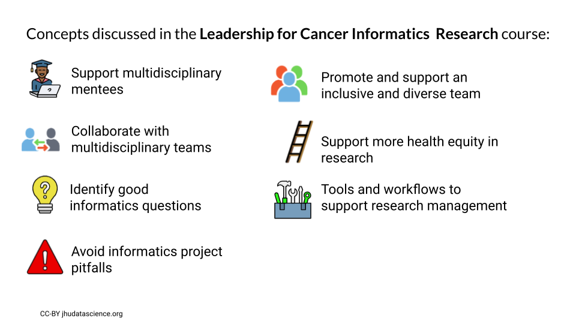

###
###
&nbsp;

## Teaching {.tabset .tabset-fade}
&nbsp;


### Instruction

2022 **Course Co-developer and Co-instructor** - <span style="background-color: #FFFF00">rated as excellent - not yet published</span>
[140.604.73 – Introduction to R for Public Health Researchers](https://github.com/jhudsl/intro_to_r), Virtual, Johns Hopkins Bloomberg School of Public Health Winter Institutes Term (24 students)

2022 **Short Course Co-instructor**
[University of Washington Biostatistics Summer Institutes](https://si.biostat.washington.edu/), Virtual, ["Data Wrangling"](https://github.com/SISBID/Data-Wrangling) (49 students)

2022 **Course Co-developer and Co-instructor** - <span style="background-color: #FFFF00">rated as [excellent](https://publichealth.jhu.edu/offices-and-services/office-of-academic-affairs/faculty-recognition/excellence-in-teaching#summer%20institutes) by students</span>
[140.604.79 – Introduction to R for Public Health Researchers](https://github.com/jhudsl/intro_to_r), Virtual, Johns Hopkins Bloomberg School of Public Health Summer Institutes Term (41 students)

2022 **Course Co-creator & Co-instructor** - not rated
[PH.140.840 – Baltimore Community Data Science](https://jhudatascience.org/Baltimore_Community_Course/), Virtual, Johns Hopkins Bloomberg School of Public Health Summer Institutes Term (11 students)

2022 **Course Co-developer and Co-instructor** - <span style="background-color: #FFFF00">rated as [excellent](https://publichealth.jhu.edu/offices-and-services/office-of-academic-affairs/faculty-recognition/excellence-in-teaching/2021-2022) by students</span>
[140.604.73 – Introduction to R for Public Health Researchers](https://github.com/jhudsl/intro_to_r), Virtual, Johns Hopkins Bloomberg School of Public Health Winter Institutes Term (32 students)

2021 **Short Course Co-instructor**
[University of Washington Biostatistics Summer Institutes](https://si.biostat.washington.edu/), Virtual, ["Data Wrangling"](https://github.com/SISBID/Data-Wrangling) (approx 45 students)

2021 **Course Co-developer and Co-instructor**
[140.604.11 – Introduction to R for Public Health Researchers](https://github.com/jhudsl/intro_to_r), Virtual, Johns Hopkins Bloomberg School of Public Health Summer Institutes Term (34 students)

2020 **Workshop Instructor**
[R-Ladies Baltimore](https://www.meetup.com/rladies-baltimore/events/263289042/), Virtual
["Wrangling a pdf with stringr"](https://carriewright11.github.io/stringr_RLadies/) (approx 40 attendees)

2020 **Workshop Instructor**
[Johns Hopkins Center for Talented Youth](https://cty.jhu.edu/), Baltimore, MD
“Research and Data Science”
Designed and taught a workshop about  Research and R programming to South Korean high school students in Baltimore (approx 12 students)

2019 **Course Instructor**
[Johns Hopkins Center for Talented Youth](https://cty.jhu.edu/), Baltimore, MD
“Introduction to Biomedical Sciences”
Designed and taught a full time two week course about Biomedical Sciences to high school students in Abu Dhabi and Ajman in the United Arab Emirates (approx 15 students each) 

2018 **Teaching Assistant**
[Baltimore Underground Science Space](http://www.bugssonline.org/), Baltimore, MD
“R you interested in big data analysis?”
Assisted with R programming analysis one-on-one with students

2018 **Teaching Assistant**
[Baltimore Underground Science Space](http://www.bugssonline.org/), Baltimore, MD
“Go with your guts! (And the billions of bacteria in them): A personal microbiome course”
Assisted with R programming analysis one-on-one with students

2017 **Workshop Instructor**
[Baltimore Underground Science Space](http://www.bugssonline.org/), Baltimore, MD
“Adventures in BIG DATA Analysis"
Designed and taught a course on data analysis using R to approximately 20 students

2013 **Teaching Assistant**
[Department of Neurosciences, University of New Mexico](https://hsc.unm.edu/medicine/departments/neurosciences/), Albuquerque, NM
“Introduction to Neurobiology”, Biomed 509 taught by Donald Partridge, Ph.D.
Assisted with grading, class organization, and discussions

2007 **Student Tutor**
[Department of Chemistry, University of New Mexico](https://chemistry.unm.edu/), Albuquerque, NM
“Organic Chemistry”, Chem 301 taught by Lisa Whalen, Ph.D.
Tutored two undergraduate students

2005 **Class Instructor**
[Explora Science Center](https://www.explora.us/), Albuquerque, NM
Taught a variety of science courses to children age 3-12

### Case Studies
1) [Exploring global patterns of obesity across rural and urban regions (Version v1.0.0).](https://www.opencasestudies.org/ocs-bp-rural-and-urban-obesity/)   
Wright, Carrie and Jager, Leah and Taub, Margaret and Hicks, Stephanie. (2020).  
https://github.com/opencasestudies/ocs-bp-rural-and-urban-obesity

<p style="text-align:center;">  </p>

2) [Predicting Annual Air Pollution (Version v1.0.0).](https://www.opencasestudies.org/ocs-bp-air-pollution/)  
Wright, Carrie and Jager, Leah and Taub, Margaret and Hicks, Stephanie. (2020).   
https://github.com//opencasestudies/ocs-bp-air-pollution  

<p style="text-align:center;"> </p> 

3) [Vaping Behaviors in American Youth (Version v1.0.0).](https://www.opencasestudies.org/ocs-bp-vaping-case-study/)  
Wright, Carrie and Ontiveros, Michael and Jager, Leah and Taub, Margaret and Hicks, Stephanie.(2020).  
https://github.com/opencasestudies/ocs-bp-vaping-case-study  

<p style="text-align:center;"> </p> 

4) [Opioids in the United States (Version v1.0.0).](https://www.opencasestudies.org/ocs-bp-opioid-rural-urban/)   
Wright, Carrie and Wang, Kexin and Jager, Leah and Taub, Margaret and Hicks, Stephanie. (2020).   
https://github.com/opencasestudies/ocs-bp-opioid-rural-urban  

<p style="text-align:center;"> </p> 

5) [Influence of Multicollinearity on Measured Impact of Right-to-Carry Gun Laws Part 1 (Version v1.0.0).](https://www.opencasestudies.org/ocs-bp-RTC-wrangling)  
Wright, Carrie and Ontiveros, Michael and Jager, Leah and Taub, Margaret and Hicks, Stephanie.(2020).  
https://github.com/opencasestudies/ocs-bp-RTC-wrangling   

<p style="text-align:center;"> </p> 

6) [Influence of Multicollinearity on Measured Impact of Right-to-Carry Gun Laws (Version v1.0.0)](https://www.opencasestudies.org/ocs-bp-RTC-analysis)   
Wright, Carrie and Ontiveros, Michael and Jager, Leah and Taub, Margaret and Hicks, Stephanie.(2020).    
https://github.com//opencasestudies/ocs-bp-RTC-analysis    

<p style="text-align:center;"> </p> 

7) [Disparities in Youth Disconnection](https://www.opencasestudies.org/ocs-bp-youth-disconnection)   
Wright, Carrie and Ontiveros, Michael and Jager, Leah and Taub, Margaret and Hicks, Stephanie. (2020).   
https://github.com/opencasestudies/ocs-youth-disconnection-case-study  

<p style="text-align:center;"> </p> 

8) [Mental Health of American Youth](https://www.opencasestudies.org/ocs-bp-youth-mental-health)  
Wright, Carrie and Ontiveros, Michael and Jager, Leah and Taub, Margaret and Hicks, Stephanie. (2020).   
https://github.com/opencasestudies/ocs-bp-youth-mental-health  

<p style="text-align:center;"> </p> 

9) [School Shootings in the United States (Version v1.0.0).](https://www.opencasestudies.org/ocs-bp-school-shootings-dashboard)  
Wright, Carrie and Ontiveros, Michael and Jager, Leah and Taub, Margaret and Hicks, Stephanie.(2020).    
https://github.com//opencasestudies/ocs-bp-school-shootings-dashboard   

<p style="text-align:center;"> </p> 

10) [Exploring CO2 emissions across time (Version v1.0.0).](https://www.opencasestudies.org/ocs-bp-co2-emissions)  
Wright, Carrie and Ontiveros, Michael and Jager, Leah and Taub, Margaret and Hicks, Stephanie.(2020).   
(https://github.com/opencasestudies/ocs-bp-co2-emissions)  
<p style="text-align:center;"> </p> 

11) [Exploring global patterns of dietary behaviors associated with health risk (Version v1.0.0).](https://www.opencasestudies.org/ocs-bp-diet)   
Wright, Carrie and Jager, Leah and Taub, Margaret and Hicks, Stephanie. (2020).  
https://github.com/opencasestudies/ocs-bp-diet   

<p style="text-align:center;"> </p> 

### Books

2022 **An Educator’s Guide to the Open Case Studies**, Carrie Wright, Michael Breshock, Lyla Atta, and Stephanie Hicks. https://leanpub.com/opencasestudies_guide

<p style="text-align:center;"> </p>

2020 **Tidyverse Skills for Data Science in R**, Carrie Wright, Shannon Ellis, Stephanie Hicks, and Roger D. Peng. https://leanpub.com/tidyverseskillsdatascience

<p style="text-align:center;"> </p>

##### Book image created by [Jessica Crowell](https://www.linkedin.com/in/jessica-crowell-b129b451/)

### Online Courses

2022 - [**Computing for Cancer Informatics**](https://jhudatascience.org/Computing_for_Cancer_Informatics/) on [Coursera](https://www.coursera.org/learn/computing-for-cancer-informatics/) and [Leanpub](https://leanpub.com/universities/courses/jhu/cancer-informatics-computing)

```{r, echo = FALSE, fig.align='center'}
knitr::include_graphics("images/computing.png")
```

```{r, echo = FALSE, fig.align='center'}
knitr::include_graphics("images/computing_who.png")
```

2021 - [**Leadership for Cancer Informatics Research**](https://jhudatascience.org/Informatics_Research_Leadership/) on [Coursera](https://www.coursera.org/learn/leadership-for-cancer-informatics-research) and [Leanpub](https://leanpub.com/universities/courses/jhu/cancer-informatics-for-research-leaders)

```{r, echo = FALSE, fig.align='center'}

```

```{r, echo = FALSE, fig.align='center'}
knitr::include_graphics("images/leadership_who.png")
```
2020  - [**Tidyverse Skills for Data Science in R Specialization**, Carrie Wright, Shannon Ellis, Stephanie Hicks, and Roger D. Peng.](https://www.coursera.org/specializations/tidyverse-data-science-r)
<p style="text-align:center;"> </p>

Including:

1) [Introduction to the Tidyverse](https://www.coursera.org/learn/tidyverse?specialization=tidyverse-data-science-r)   2. [Importing Data in the Tidyverse](https://www.coursera.org/learn/tidyverse-importing-data?specialization=tidyverse-data-science-r)    3. [Wrangling Data in the Tidyverse](https://www.coursera.org/learn/tidyverse-data-wrangling?specialization=tidyverse-data-science-r)     4. [Visualizing Data in the Tidyverse](https://www.coursera.org/learn/tidyverse-visualize-data?specialization=tidyverse-data-science-r)   5. [Modeling Data in the Tidyverse](https://www.coursera.org/learn/tidyverse-modelling-data)  


##### Course images created by [Jessica Crowell](https://www.linkedin.com/in/jessica-crowell-b129b451/)

### Mentorship

#### **Academic Advisees**

- Capstone Advisor for [Logan, Eean](https://www.linkedin.com/in/eeanthomas/). Master of Public Health. Johns Hopkins Bloomber School of Public Health, Baltimore, MD (2022).

- Thesis Advisor for [Breshock, Michael](https://mbreshock.github.io/). Master of Science in Engineering, Biomedical Engineering.  Johns Hopkins University, Baltimore, MD (2020 - 2021).[Thesis Link](https://jscholarship.library.jhu.edu/handle/1774.2/66820).


#### **Research Advisees**

- [Afiaz, Awan](https://www.biostat.washington.edu/people/awan-afiaz). Graduate Research Assistant. Doctorate of Biostatistics. University of Washington, Seattle, WA (2023). (Served as co-supervisor with Jeff Leek.)

- [Hwang, Jimin](https://www.linkedin.com/in/jimin-hwang-549835142). Graduate Research Assistant. Master of Public Health.  Johns Hopkins University, Baltimore, MD (2022). _Worked with Jimin to create scientific communication cartoons._

- [Rout, Pratik](https://www.linkedin.com/in/pratik-rout-b524901a5/). Graduate Research Assistant. Master of Science, Bioinformatics.  Johns Hopkins University, Baltimore, MD (2022). _Mentored Pratik to create interactive tables for ITCR tools._

- [Atta, Lyla](https://lylaatta.github.io/). Graduate Research Assistant. Doctor of Philosophy, Biomedical Engineering.  Johns Hopkins University, Baltimore, MD (2021 - 2022). _Mentored Lyla as we created a guide for instruction with our case studies._

- [Breshock, Michael](ttps://mbreshock.github.io/). Research Assistant. (Not in a degree program at the time - just graduated with Master of Science in Engineering degree),  Department of Biostatistics. Johns Hopkins Bloomberg School of Public Health, Baltimore, MD (2021 - 2022). _Mentored Michael to create OCSdata R package and to create other case study tools and resources, as well as perform research on case study usage._

- [Meng, Qier](https://www.linkedin.com/in/qiermeng/). Graduate Research Assistant. Master of Science, Biostatistics. Johns Hopkins Bloomberg School of Public Health, Baltimore, MD (2020 - 2021). _Mentored Qier, as she made case studies interactive._

- [Ontiveros, Michael](https://www.michaelontiveros.com/). Graduate Research Assistant. Master of Health Sciences, Epidemiology. Johns Hopkins Bloomberg School of Public Health, Baltimore, MD (2020). _Worked with Michael to create case studies._ 

- [Rajpurohit, Nina](https://www.linkedin.com/in/nina-rajpurohit-a144121b1/). Research Associate. Lieber Institute for Brain Development, Baltimore, MD (2017). _Trained and guided Nina through a gene expression research project._ 

- [Brusilovsky, Jane](https://www.linkedin.com/in/janebrusilovsky/). Undergraduate Student Researcher. Bachelors of Science, Bioengineering.  Lieber Institute for Brain Development, Baltimore, MD (2017). _Trained and guided Jane through a gene expression research project._ 

- [Astorga, Daniel](https://www.linkedin.com/in/astorgamha/). Undergraduate Student Researcher. Bachelors of Science, Biology. The Mind Research Network, Albuquerque, NM (2013).   _Trained and guided Daniel through an imaging genetics research project._ 

#### **Thesis Committees/Thesis Reader**

- [Breshock, Michael](https://mbreshock.github.io/). Master of Science in Engineering. Biomedical Engineering, Johns Hopkins Whiting School of Engineering, Baltimore, MD.
  Thesis entitled "Expanding Access and Removing Barriers: Data Science Education with the Open Case Studies Digital Platform" (2020-2021). 

- [Michael Patrick Geaghan](https://www.researchgate.net/profile/Michael-Geaghan). International Doctoral Thesis Examiner.
  Thesis entitled "Characterising Transcriptional Perturbations Arising from Altered Expression of Schizophrenia-Associated MicroRNA" for the School of Biomedical Sciences and Pharmacy, University of Newcastle, Australia (2019). 
